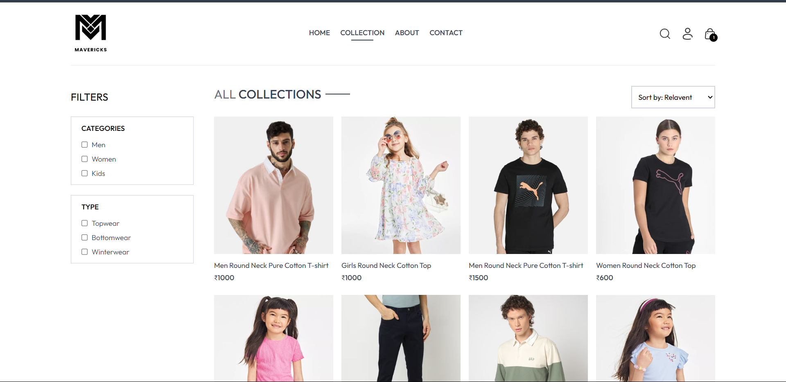

# 🛍️ Mavericks - Modern E-commerce Platform

[](https://mavericks-app.vercel.app)

[](LICENSE)

A full-featured e-commerce platform built with modern web technologies, offering a seamless, installable, offline-capable shopping experience.

## Table of Contents

- [Demo](#demo)
- [Features](#-features)
- [Tech Stack](#-tech-stack)
- [Getting Started](#-getting-started)
- [Project Structure](#-project-structure)
- [PWA Guide](#-pwa-guide)
- [Contributing](#-contributing)
- [License](#-license)

## Demo

Watch the product demo video here:

- ▶️ Video: [Watch the demo](https://raw.githubusercontent.com/vinayak746/Mavericks/main/frontend/public/mavericks_video_new.mp4)

Inline preview (HTML5 video player on GitHub-compatible viewers):

<video src="https://raw.githubusercontent.com/vinayak746/Mavericks/main/frontend/public/mavericks_video_new.mp4" controls autoplay muted loop playsinline width="720" poster="frontend/public/mavericks-home.png">
   Your browser does not support the video tag.
   <a href="https://raw.githubusercontent.com/vinayak746/Mavericks/main/frontend/public/mavericks_video_new.mp4">Watch the demo</a>
</video>

### Screenshots

<table>
   <tr>
      <td align="center">
         
         <br/>
         <sub>Home</sub>
      </td>
      <td align="center">
         
         <br/>
         <sub>Collections</sub>
      </td>
   </tr>
</table>

## 🚀 Features

### User Features
- 🔐 Secure authentication (Register/Login/Logout)
- 🛒 Shopping cart management
- 📦 Order history and tracking
- 👤 User profile management
- 🔍 Advanced product search and filtering
- ⭐ Product reviews and ratings

### Progressive Web App (PWA)
- 📲 Installable on desktop and mobile with a custom install prompt
- ⚡ Offline-first: app shell and cached content load without network
- 🖼️ Image caching via Workbox (Cache First for product images and icons)
- 🛍️ Offline cart persistence (local storage) with seamless merge on login
- 🧾 Offline order queue (COD): queue orders while offline and auto-sync on reconnect
- 🔁 Automatic sync-on-reconnect for cart and queued orders
- 🧹 Safe service worker updates (skipWaiting + clientsClaim) and outdated cache cleanup

### Admin Features
- 📊 Dashboard with sales analytics
- 🏷️ Product management (CRUD operations)
- 📝 Order management
- 👥 User management

## ✨ Key User Flows

- Browse and filter products across categories and types
- Add to cart, change sizes/quantities, and remove items
   - Helpful toasts appear when the cart updates
- Checkout options:
   - Cash on Delivery (COD)
   - Stripe payment 
- Install the app as a PWA and use it like a native app
- Offline flow (PWA):
   - Go offline → continue browsing cached products and images
   - Add to cart (stored locally)
   - Place COD order → it’s queued safely
   - Reconnect → cart and queued orders are synced automatically

## 🛠️ Tech Stack

### Frontend
- ⚛️ React.js
- 🎨 Tailwind CSS
- 🔄 React Router
- 🚀 Vite
- 📱 Fully responsive design

### Backend
- 🟢 Node.js
- 🚄 Express.js
- 🍃 MongoDB (with Mongoose)
- 🔐 JWT Authentication
- 🌐 RESTful API

### Deployment
- ☁️ Vercel (Frontend)
- 🚀 Render (Backend)
- 🍃 MongoDB Atlas (Database)
- 🌐 Cloudinary (Image Storage)

## 🚀 Getting Started

### Prerequisites
- Node.js (v16 or higher)
- npm or yarn
- MongoDB Atlas account
- Cloudinary account (for image storage)

### Installation

1. **Clone the repository**
   ```bash
   git clone https://github.com/vinayak746/Mavericks.git
   cd Mavericks
   ```

2. **Install dependencies**
   ```bash
   # Install frontend dependencies
   cd frontend
   npm install
   
   # Install backend dependencies
   cd ../backend
   npm install
   ```

3. **Environment Setup**
   - Create a `.env` file in the `backend` directory with:
     ```
     MONGODB_URI=your_mongodb_uri
     JWT_SECRET=your_jwt_secret
     CLOUDINARY_CLOUD_NAME=your_cloudinary_cloud_name
     CLOUDINARY_API_KEY=your_cloudinary_api_key
     CLOUDINARY_API_SECRET=your_cloudinary_api_secret
     ```

4. **Running the application**
   ```bash
   # Start backend server (from backend directory)
   npm run dev
   
   # In a new terminal, start frontend (from frontend directory)
   cd frontend
   npm run dev
   ```

### PWA: Test Offline and Install

1. Start the frontend build/preview or run in production mode for best results.
2. Open the app in Chrome/Edge.
3. Install the app:
   - When you see the install prompt in-app, click Install, or
   - Use the browser menu: Install app / Add to Home Screen.
4. Test offline capability:
   - Open DevTools → Application → Service Workers → check "Offline"
   - Navigate around: the app shell, product list (from cache), and images should still load
5. Try cart and orders offline:
   - Add items to cart (persisted locally)
   - Place COD order while offline → it will be added to the queued orders and synced automatically once online
6. To reset: Clear Storage (DevTools → Application → Clear storage) and reload.

## 📂 Project Structure

```
Mavericks/
├── admin/              # Admin dashboard frontend
├── backend/            # Backend server
│   ├── config/         # Configuration files
│   ├── controllers/    # Route controllers
│   ├── middleware/     # Custom middleware
│   ├── models/         # Database models
│   └── routes/         # API routes
├── frontend/           # Main frontend application
│   ├── public/         # Static files
│   └── src/            # React components and logic
└── README.md           # Project documentation
```

## 🤝 Contributing

Contributions are welcome! Please feel free to submit a Pull Request.

1. Fork the repository
2. Create your feature branch (`git checkout -b feature/AmazingFeature`)
3. Commit your changes (`git commit -m 'Add some AmazingFeature'`)
4. Push to the branch (`git push origin feature/AmazingFeature`)
5. Open a Pull Request

## 📄 License

This project is licensed under the MIT License - see the [LICENSE](LICENSE) file for details.

## Acknowledgments

- [React Icons](https://react-icons.github.io/react-icons/)
- [Tailwind CSS](https://tailwindcss.com/)
- [Vite](https://vitejs.dev/)

---

Author: [Vinayak](https://github.com/vinayak746/)

---

## PWA Guide

Mavericks ships with a robust PWA setup using Vite and Workbox:

- Service Worker is generated via `vite-plugin-pwa` with:
   - Precache of core assets and icons
   - Runtime caching for:
      - Images: Cache First with long-lived cache
      - API calls: Network First with fallback for reliability
- Manifest includes multiple icon sizes (including 144×144) for installability
- Offline UX:
   - Products are cached locally (localStorage) as a fallback when network fails
   - Cart state is stored locally and merged with the server on login/reconnect
   - COD orders can be queued offline and automatically placed when back online
   - An offline indicator component surfaces connectivity and queued orders

Developer tips:

- If you change service worker or PWA config, rebuild and hard-reload the app
- To test updates: DevTools → Application → Service Workers → Unregister, then reload
- For deeper inspection, open DevTools → Application → Cache Storage and IndexedDB/localStorage
